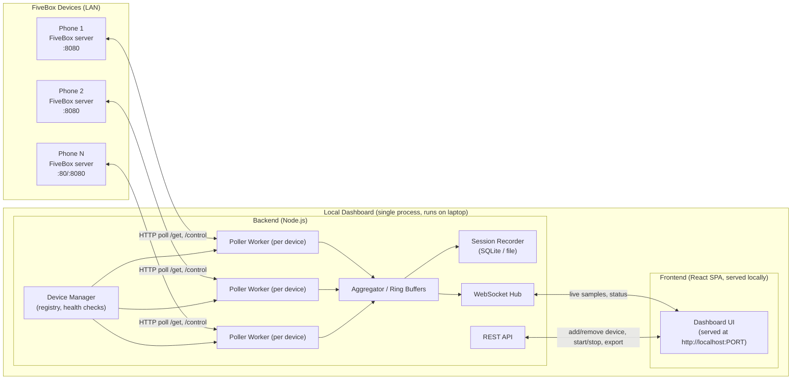
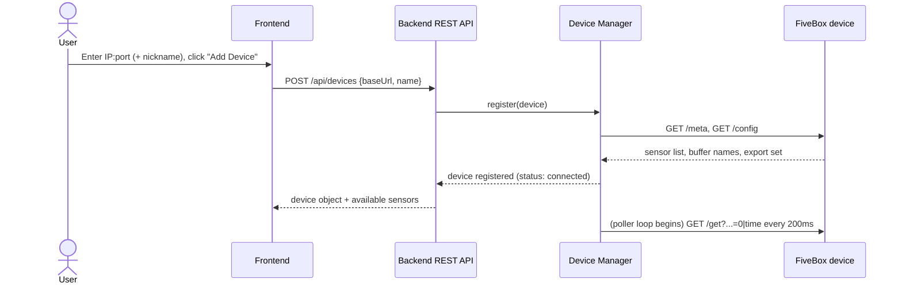
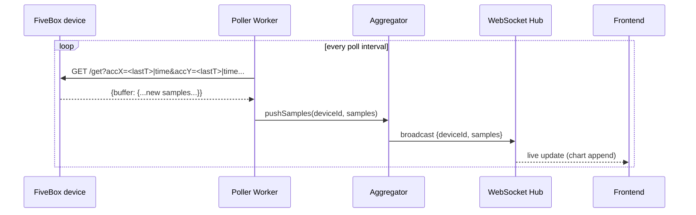
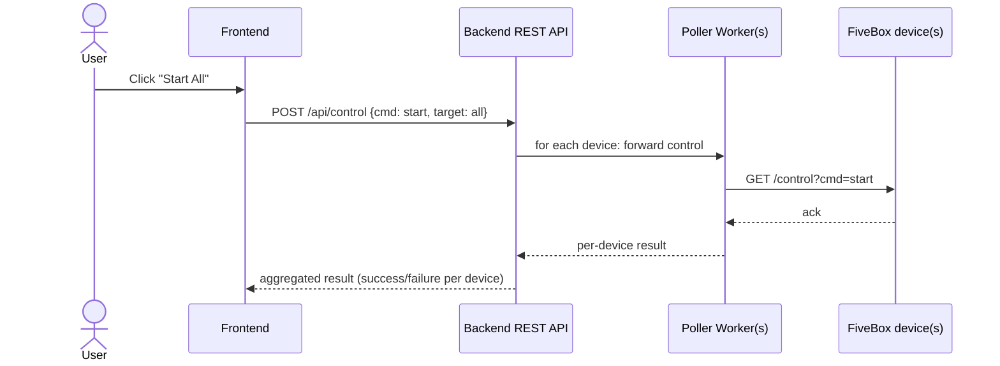
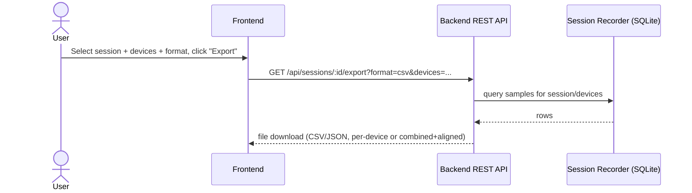

# FiveBox Local Dashboard — Implementation Plan

## 0. Context & Goal

Each mobile device runs a **FiveBox server** — a phyphox-compatible embedded HTTP server exposing sensor data over an unauthenticated JSON/REST interface (`/get`, `/config`, `/meta`, `/control`, `/time`, `/export`), reachable only from devices on the same LAN segment (typically a phone hotspot). There is no push/streaming channel — live data is obtained by polling `/get` with incremental (threshold-based) requests.

We need a **local web dashboard** (runs on a researcher's laptop, no cloud dependency) that:

- Connects to **multiple** FiveBox devices concurrently.
- Displays their sensor streams live.
- Lets the user filter, annotate, and manage the incoming data.
- Provides controls (start/stop/clear, per-device and synchronized-all) with a clean UI.

Because the FiveBox/phyphox interface is poll-only and unauthenticated, the dashboard's own backend does the polling and re-publishes the data over a push channel (WebSocket) to the browser UI — this isolates the browser from having to manage N concurrent polling loops and gives us a single point to add buffering, recording, and reconnection logic.

---

## 1. System Architecture



**Key architectural decision:** a single local backend process owns all phone connections. The browser never talks to phones directly (avoids CORS/mixed-origin issues, and lets us keep polling alive even if the dashboard tab is closed/reloaded). The browser only talks to `localhost` over WebSocket (live data) and REST (control/config/export).

### 1.1 Backend responsibilities
- **Device Manager**: in-memory registry of configured devices (`id`, `name`, `baseUrl`, `platform hint`, connection `status`). Persisted to a small local config file so devices survive restarts.
- **Poller Worker** (one async loop per device): calls `/meta` + `/config` once on connect to discover available buffers/sensors, then loops on `/get?<buffers>=<threshold>|time` at a configurable interval (default 200 ms), with exponential backoff on failure and automatic reconnect.
- **Aggregator**: normalizes each device's samples into a common shape, maintains a bounded in-memory ring buffer per (device, buffer) pair for the live view, and forwards every sample batch to the Recorder and the WebSocket Hub.
- **Session Recorder**: append-only local store (SQLite) of every sample when a "recording session" is active, plus session metadata (start/stop time, devices included, sensors included) — this is what powers export.
- **REST API**: CRUD for devices, session start/stop/export, per-device and global control passthrough (`start`/`stop`/`clear`), settings (polling interval, buffer size).
- **WebSocket Hub**: fan-out of live samples + device status changes to all connected browser tabs.

### 1.2 Frontend responsibilities
- Renders the multi-device dashboard grid, live charts, controls, device management, and export/session UI, entirely from data supplied by the local backend's REST/WebSocket API. No direct network calls to phones.

---

## 2. Technology Stack

| Layer | Choice | Rationale |
|---|---|---|
| Backend runtime | **Node.js + TypeScript** | Single language across stack; excellent async HTTP client support (`undici`/`axios`) for concurrent polling; trivial WebSocket server (`ws`); easy to package as a local CLI (`npx fivebox-dashboard`). |
| Backend framework | **Fastify** (or Express) | Minimal REST layer for device/session/config endpoints. |
| Realtime transport | **`ws`** (WebSocket) | Simple, no extra broker needed for a single-laptop app. |
| Local persistence | **SQLite via `better-sqlite3`** | Zero-config embedded DB, fine for a local desktop tool; stores sessions/samples for export and replay. Device list config as a small JSON file. |
| Frontend framework | **React + TypeScript + Vite** | Fast dev loop, wide component ecosystem, easy to serve as static build from the same Node process. |
| Charting | **uPlot** (or `lightweight-charts`) | Canvas-based, built for high-frequency real-time multi-series time-series rendering — far more headroom than SVG chart libs (Recharts/Chart.js) once several devices × several sensors are live at once. |
| State management | **Zustand** | Lightweight store for device list, live buffers, UI state — avoids Redux boilerplate for a tool this size. |
| Styling | **Tailwind CSS** | Fast to build a clean, consistent UI without a design system dependency. |
| Packaging (MVP) | **Local Node server + auto-open browser tab** (Jupyter/Grafana-style: `npm start` → opens `http://localhost:4173`) | Ships fastest, no OS-specific build pipeline. |
| Packaging (later, optional) | **Electron wrapper** around the same frontend/backend | Only pursue once the web-based MVP is validated, for a native "double-click to launch" experience. |

This keeps the entire stack in JavaScript/TypeScript, which simplifies sharing types (e.g., a `Sample`/`Device` interface) between backend and frontend via a shared `packages/shared` workspace.

---

## 3. Communication Flow

### 3.1 Adding a device


### 3.2 Live data to the browser


### 3.3 Control commands (start/stop/clear, per-device or "all")


### 3.4 Export


---

## 4. Core Features

### MVP (must-have)
1. **Device management** — add device by `IP[:port]` + nickname, see live connection status (connected / reconnecting / offline), remove device. Support both Android (`:8080`) and iOS (`:80`, port optional) address forms.
2. **Auto sensor discovery** — on connect, fetch `/meta` + `/config` and let the user pick which buffers/sensors to display per device, instead of hardcoding sensor names.
3. **Live multi-device dashboard** — a responsive grid of device cards, each streaming its selected sensors as real-time charts + current numeric readout.
4. **Per-device controls** — start / stop / clear buttons wired to `/control`.
5. **Global controls** — "Start All" / "Stop All" / "Clear All" for synchronized multi-device experiments.
6. **Basic recording** — toggle "Record Session," buffers everything to local SQLite while active.
7. **Export** — download recorded session as CSV or JSON, per device or time-aligned combined file.
8. **Resilience** — automatic reconnect with backoff if a phone drops off the network; UI clearly flags stale/disconnected devices rather than silently freezing.

### Nice-to-have (post-MVP)
9. **Timestamp alignment across devices** using each device's `/time` endpoint, so multi-phone sessions can be correlated to wall-clock time.
10. **Filtering/search** within a session's recorded data (time range scrub, sensor filter) before export.
11. **Threshold alerts** (e.g., flag when a value exceeds a bound) — visual highlight only, no external notifications for v1.
12. **Session replay** — re-play a recorded session through the same chart UI as if it were live.
13. **Light/dark theme, layout presets** (grid density, per-device full-screen focus mode).
14. **Config file import/export** for device lists (share a lab setup between machines).

### Explicitly out of scope for v1
- Cloud sync / remote access from outside the LAN.
- Authentication on the FiveBox/phyphox side (not something we control — dashboard should surface a one-time warning about operating on a private network only).
- Mobile-responsive dashboard (this is a desktop-facing lab tool; graceful degradation only, not a design goal).

---

## 5. UI Components

```
┌───────────────────────────────────────────────────────────────────────────┐
│ Top Bar:  FiveBox Dashboard      [● Recording 00:32]  [Start All] [Stop All│
│                                   [Clear All]  [Export ▾]  [Settings ⚙]    │
├───────────┬─────────────────────────────────────────────────────────────┤
│ Sidebar   │  Dashboard Grid                                              │
│           │  ┌───────────────┐  ┌───────────────┐  ┌───────────────┐     │
│ Devices   │  │ Phone A  ●conn│  │ Phone B  ●conn│  │ Phone C ●retry│     │
│  ● A      │  │ [accel][gyro] │  │ [pressure]    │  │  (reconnecting)│    │
│  ● B      │  │  live chart   │  │  live chart   │  │  ...          │     │
│  ○ C      │  │ x:.. y:.. z:..│  │ 1013.2 hPa    │  │               │     │
│           │  │ [▶][■][clear] │  │ [▶][■][clear] │  │ [▶][■][clear] │     │
│ [+ Add]   │  └───────────────┘  └───────────────┘  └───────────────┘     │
│           │  (click a card → expand to full detail view)                 │
└───────────┴─────────────────────────────────────────────────────────────┘
```

| Component | Purpose |
|---|---|
| **Top bar** | App title, recording indicator + elapsed time, global Start/Stop/Clear, Export menu, Settings. |
| **Device sidebar** | List of configured devices with live status dot (connected / reconnecting / offline), "+ Add Device" opens a modal (IP/host, port, nickname). Click a device to focus it. |
| **Add Device modal** | Fields: host/IP, port (prefilled 8080, hint for iOS :80), nickname. On submit, calls backend, shows discovered sensors for confirmation before saving. |
| **Device card** (grid item) | Header (name, status, small menu: rename/remove/reconnect), sensor tabs (only buffers the user opted into), live chart (uPlot canvas), latest numeric readout row, per-device transport controls (start/stop/clear). |
| **Device detail view** | Full-screen version of a card: all selected buffers as stacked or tabbed charts, larger time window, per-sensor visibility toggles, raw value table. |
| **Sensor picker** | Per-device checklist (from `/config` export set + `/meta`) to choose which buffers appear on the card/detail view. |
| **Export modal** | Choose session, choose devices/sensors, choose format (CSV/JSON), choose "combined & time-aligned" vs "per-device raw," triggers download. |
| **Settings panel** | Global polling interval, chart window length (seconds shown), ring-buffer size, theme toggle, "always on private network" reminder banner. |
| **Toasts/inline errors** | Non-blocking notification when a device disconnects, a control command fails, or export completes. |

---

## 6. Data Model (shared types)

```ts
interface Device {
  id: string;
  name: string;          // user nickname
  baseUrl: string;        // e.g. http://192.168.43.23:8080
  status: 'connected' | 'reconnecting' | 'offline';
  sensors: SensorMeta[];  // discovered from /meta + /config
  selectedBuffers: string[];
  lastSeen?: number;      // epoch ms
}

interface SensorMeta {
  bufferName: string;     // phyphox buffer key
  label: string;          // human-readable
  unit?: string;
}

interface Sample {
  deviceId: string;
  bufferName: string;
  t: number;              // device experiment time (or aligned wall-clock)
  v: number;
}

interface Session {
  id: string;
  startedAt: number;
  endedAt?: number;
  deviceIds: string[];
}
```

---

## 7. Security & Network Considerations
- FiveBox/phyphox's remote interface is **unauthenticated** — the dashboard cannot add security on the phone side. Surface a one-time banner: *"Only connect to devices on a private, trusted network (e.g., phone hotspot). Anyone on this network can read and control connected devices."*
- The dashboard's own backend binds to `localhost` by default; do not bind `0.0.0.0` unless the user explicitly opts in (e.g., to view the dashboard from another device on the same LAN).
- No external network calls other than to configured device IPs — no analytics/telemetry.
- Validate/sanitize user-entered host:port before constructing request URLs (basic allowlist of hostname/IP + port pattern) to avoid SSRF-style misuse of the backend as an open proxy.

---

## 8. Phased Development Roadmap

**Phase 0 — Project scaffolding** (0.5–1 day)
- Monorepo layout: `backend/`, `frontend/`, `shared/` (types).
- Tooling: TypeScript, ESLint/Prettier, Vitest/Jest, basic CI (lint + typecheck + test).

**Phase 1 — Single-device polling backbone** (2–3 days)
- FiveBox HTTP client: `getMeta`, `getConfig`, `getBuffers` (threshold-based), `control(cmd)`.
- One Poller Worker, in-memory ring buffer, minimal REST (`POST /api/devices`, `GET /api/devices`) and WebSocket broadcast.
- Goal: `curl`/Postman-verifiable end-to-end pipeline from one real (or simulated) FiveBox device to a WebSocket message.

**Phase 2 — Minimal frontend, one live chart** (2–3 days)
- React app scaffold, WebSocket client, single device card with one uPlot chart proving live rendering works.
- Add Device modal wired to the real API.

**Phase 3 — Multi-device support** (3–4 days)
- Device Manager supports N concurrent pollers; dashboard grid renders N cards.
- Per-device connection status, reconnect/backoff logic, sensor picker UI driven by discovered `/meta`+`/config`.

**Phase 4 — Controls** (2 days)
- Per-device start/stop/clear buttons; global Start All/Stop All/Clear All with per-device result reporting (so partial failures are visible, not silently swallowed).

**Phase 5 — Recording & export** (3–4 days)
- SQLite-backed Session Recorder; Record toggle in top bar; Export modal (CSV/JSON, per-device vs combined+aligned via `/time`).

**Phase 6 — UX polish & resilience** (2–3 days)
- Device detail/full-screen view, settings panel (poll interval, window length, theme), toasts for errors, empty/loading states, private-network warning banner.

**Phase 7 — Packaging & docs** (1–2 days)
- `npm start` launches backend + serves built frontend + opens browser tab.
- README: setup, how to enable FiveBox remote access on a phone, troubleshooting (network isolation, iOS port 80, etc.).
- (Optional, later milestone) Electron wrapper for a native double-click launch experience.

**Total estimate:** roughly 3–3.5 weeks of focused solo development for Phases 0–7 (MVP through polish + packaging), before optional nice-to-haves.

---

## 9. Open Questions for the User
- Preferred data-persistence format for export: raw per-device CSV, a single time-aligned combined CSV, or both?
- Expected max number of concurrent devices (affects whether 200 ms polling per device is safe, or whether we need adaptive interval scaling)?
- Is an Electron-packaged desktop app a hard requirement, or is "run `npm start`, dashboard opens in your default browser" acceptable for v1?
